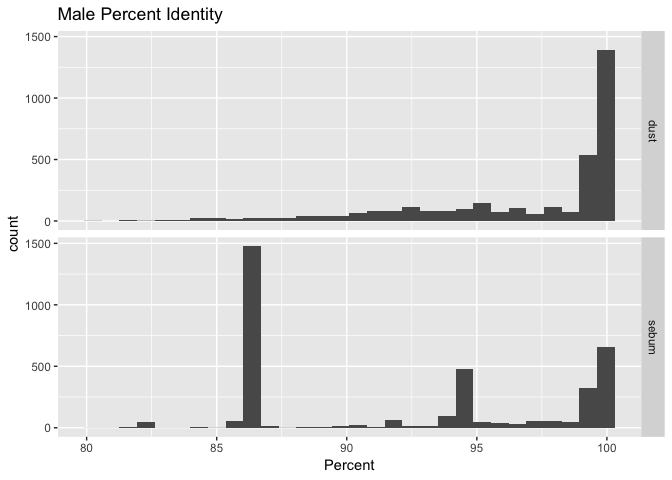
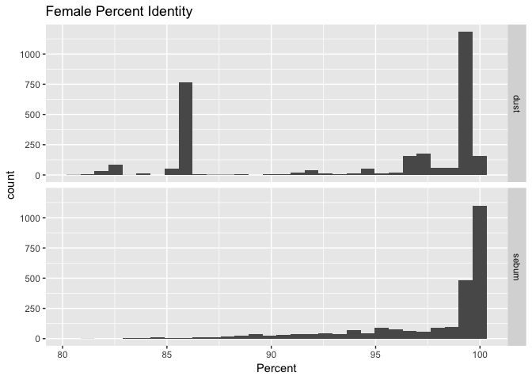
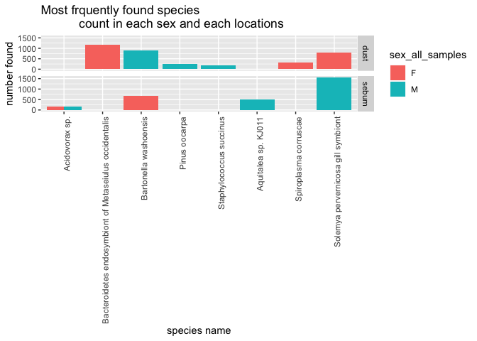

Analysis of BLAST Results
================
Maggie Chen
October 12, 2018

Introduction
============

This is a further analysis of the research performed by researchers from University of South Columbia, who intend to investigate whether microbe community on human skins will match the microbe community on objects touched by the same individual. Microbe community refers to the microorganisms composition in a shared living space. In this research, the main focus is on the bacterial community composition. Bacteria is a type of biological cell, and it is a member of unicellular microorganisms group. Bacteria have various shape and length, as well as different effect on human bodies. The research was also intend to use this method as an additional tool of forensic examination. Forensic investigation is denoting the application of scientific methods and techniques to the investigation of crime. Thus, it is possible to match the microbe community on suspect's hand with the object the suspect has touched as one form of forensic evidence. Overall, the sample swabbing, extraction, amplification, and sequencing was done by researchers from University of South Columbia at University of Colorado. Then, using the sequence data and the metadata, I was able to run several more analysis on the sequence and use BLAST to identify species from the sequence. The metadata is the information about the sequence including the information about sampling individuals and sampling conditions. Basic Local Alignment Sequence Tool(BLAST), is a method using alignment to match portions in the sequence of interest with the sequence in the database, which is already unknown for species names.

Methods
=======

Sample origin and sequencing
----------------------------

For sampling, in the same building at the University of Colorado, five healthy male and four healthy female in between the age of 20 and 35 were recruited for sampling. The entire surface of each computer mouse and the palm surface of the individual's dominant hand, which is commonly used to operate the mouse was swabbed. To ensure the sampling quality the mouse has been touched by the owner within 12h before the swabbing. Palm swabbing was done while each individual remained their typical hand hygiene practices. All swab samples are stored at -80 ºC before DNA extraction.

The DNA extraction was performed using the MO BIO PowerSoil DNA isolation kit. For each sample, the primers are optimized for the phylogenetic analysis of pyrosequencing reads. Then PCR reaction was used to amplify the sequence. If the final sequence length is less than 200 or more than 300bp in length, or has a quality score lower than 25, or contains either ambiguous character or correctable barcode, or lacking primer sequence, it will be removed from the analysis.

Computational
-------------

To determine the distance of between pairs of bacterial communities, the UniFrac metric was used. This is based on the fraction of branch length shared between communities being compared within a phylogenetic tree constructed from the 16S rRNA gene, which is sequenced from all communities being compared.

In addition to the analysis performed in the research project, I also run several analysis on the sequence data. Using the data gained from the sequencing in the research. Firstly, I run a quality check on all the sequences, and this is called QuickCheck, which generates a QC report with quality evaluations of the sequence based on different parameters like GC content, the regional quality score of the sequence. Then, based on the quality score of the sequence, I trimmed out the low quality(lower than 25) portions in each sequence. So far, I have only working on the sequence in the format of '.fasta'. However, the final goal for this sequence processing is to use BLAST to identify different species within each sequence, which only accepts '.fastq' file. Thus, I used 'biowak' to convert all the trimmed sequences into '.fastq' format. Lastly, I input all the converted sequences into BLAST, to identify all the species in the sample taking by researches. Overall, to process this analysis faster, the work was done on a remote machine with better capability than personal laptops. To analyze the BLAST result, as a primary interpretation, codes are written to count and summarize the species names found. For further analysis, R is used to generate different graphs, which will be demonstrated in the later portion of this file.

Results
=======

In order to further analyze the BLAST data, graphs are generated to illustrate different patterns and interesting findings in the data. Firstly, 'pident' is a abbreviation of percent identity, which presents to what percentage the sequence being found matches with the sequence in the BLAST database. The lower the percentage, the less reliable the match is. In Figure2, for the bacteria species found on male palm and male touched mouse, there is a difference in sequence matching qualities. 'dust' refers to the sample taken from the mouse, 'sebum' refers to the data taken from human palm. As Figure2 demonstrate, sequences from male touched mouse has a good matching quality, in which most of the sample sequence has 100% match. The samples of male palm has a variation of percent identity, some are at 100% and 93%. However, most abundant are at 85%. In Figure3, the percent identity of female samples is opposite with male.

Almost all the samples from female palm have 100% identity. On the other hand, samples from female touched mouse sample has concentrated at 85% identity, with some at 93% and 100% identity. In Figure1, it is a count of repeating numbers of each species that has percent identity between 85% and 87%. As Figure1 presents, for species that have percent identity between 85% and 87%, Solemya pervernicosa gill symbiont is the species that has the highest times being identified in BLAST. Figure4 demonstrate in both groups of mouse and palm samples, by the separation of female and male, the top 8 most frequently found species. Solemya pervernicosa gill symbiont is most frequently found species overall, and only found in male palm and female mouse. Bartonella washoensis is the second commonly found species that is only found in male mouse and female palm. Acidovorax sp. is only found on both female and male palm. Pinus oocarpa and Staphylococcus succinus are only found on the male mouse. In table1. it is a summary of the amount of species found in each individual's samples, including the repeating species.

### Graphs

    ## # A tibble: 6 x 2
    ##   sscinames                              n
    ##   <fct>                              <int>
    ## 1 Solemya pervernicosa gill symbiont  2372
    ## 2 Geosporobacter sp. IRF9               11
    ## 3 Gram-negative bacterium cL10-2b-4      8
    ## 4 Bacteroides uniformis                  7
    ## 5 Eggerthellaceae bacterium              6
    ## 6 bacterium NLAE-zl-C273                 5

Figure1. This figure to illustrate percent identity in the range between 85% and 87%, about how many times each species are identifies. The most abundant match is Solemya pervernicosa gill symbiont, then Geosporobacter sp. IRF9 with a significant lower repetition times. This figure is only showing the species that has more than 3 times of repetition.

    ## `stat_bin()` using `bins = 30`. Pick better value with `binwidth`.

Figure2.Sequences from male touched mouse has a good matching quality, in which most of the sample sequence has 100% match. The samples of male palm, has a variation of percent identity, some are at 100% and 93%. However, the most abundant are at 85%.

    ## `stat_bin()` using `bins = 30`. Pick better value with `binwidth`.

Figure3. Almost all the samples from female plum has 100% identity. Samples from female touched mouse sample has concentrated at 85% identity, with some at 93% and 100% identity.

Figure4. In both groups of mouse and plum samples, by the separation of female and male, the top 8 most frequently found species. Solemya pervernicosa gill symbiont is most frequently found species overall, and only found in male palm and female mouse. Bartonella washoensis is the second commonly found species that is only found in male mouse and female palm. Acidovorax sp. is only found on both female and male palm. Pinus oocarpa and Straphylococcus succinus are only found on male mouse.

|     |  computer mouse|  right palm|
|-----|---------------:|-----------:|
| F2  |             396|         410|
| F5  |             365|         777|
| F6  |             662|         422|
| F7  |             655|         546|
| F8  |             878|         374|
| M1  |             456|         878|
| M2  |             670|         775|
| M7  |             970|         689|
| M8  |             717|         280|
| M9  |             571|         968|

Table1. A summary of amount of species found in each individual's samples, including the repeating species.

Discussion
==========

The percent identity variation was observed in both female and male sample, however, in the opposite patterns. The high percent identify for most of the samples was in the female palm and male mouse, which is not observed in female mouse and male palm samples. One possible explanation is that the species Solemya pervernicosa gill symbiont as showed in Figure1 is the primary cause of this variation. According to Figure3, Solemya pervernicosa gill symbiont was only found in female mouse and male palm sample. Also, due to more than two thousand Solemya pervernicosa gill symbiont was identified in all the sample and it has relatively low percent identity (around 85%). Thus, the peak around 85% percent identity was generated only with female mouses and male palm samples, while female palm and male mouse was not affected. Solemya pervernicosa gill symbiont was not found in both male palm and male mouse, same for females. This inconsistency requires more experiments for further investigation. In Table1 the amount of species identifies in each individual's palm and mouse does not match, this might due to some species has a high number of repetition, which is not necessarily generated by identification of different species. However, this difference also indicates there are some other factors affect the microbe community composition.

Overall, as shown in Figure1, Figure2, and Figure3, the samples are in acceptable quality, except the Solemya pervernicosa gill symbiont. There are several possible reasons why the Solemya pervernicosa gill symbiont has a high identification rate with low percent identity. One is that the species found in the sample are not the same species within the BLAST database. In this case, a more detail analysis is needed to determine whether the specie found is Solemya pervernicosa gill symbiont or not. Another possible reason is that there are parts of the sequence got trimmed out due to the low sequence quality, due to the in-completion and some mismatch, it then has a low percent identify. One thing to note is that mismatch does not always yield dysfunction or mutation of the organism.

As for the biological significance of the species found in samples. Solemya pervernicosa gill symbiont's common name is gammaproteobacteria. Proteobacteria is a major phylum of gram-negative bacteria, which include a wide range of pathogens. Bartonella washoeensis belongs to the genus of bartonella, which is first isolate from dog with mistral valve endocarditis, then it was also found on the human with cardiac disease(Bruno ,etc. 2018). This can also be an indication of pets' disease or bacteria that are related to the human disease can be passed on from daily lives. Straphylococcus succinus is a gram-positive bacteria, which is found on cheese, sausages and healthy wild animal skins, it was also isolated from clinical material. However, its parthenogenesis has yet to investigate. Pinus oocarpa is a species of pine tree native to Mexico and Central America. In summary, the biological significance of each species being identified was not clear yet. And there is a possibility that the sample sequence is too short thus it matches an irrelevant species in the database.

In summary, there is very less correlation between the microbe community on human hands and object touched by the same individual. The most commonly found species has a variant location and function. Also, the biological significance of each species found needs further investigation.
